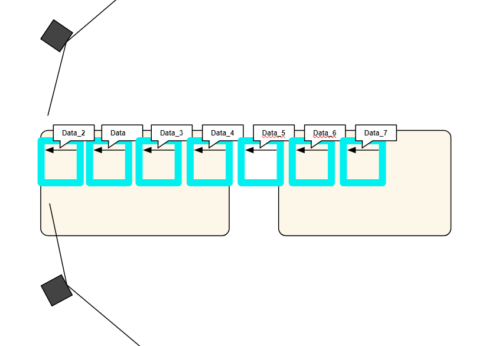
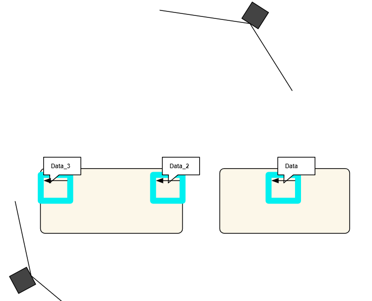

First are explained data of the experimentations. In other words, the correspondence between the name of the files and what has been measured is shown. Main results of the experimentation follows. 

## Experimentation

Python files are for the experiment : reception.py, processing.py and kalman.py. They are from the Kalman-Filter repository (https://github.com/JulienMellet/Kalman-Filter) ; test.py uses the Plotter to draw patterns and save measurements data into a text file ; data_processing.py draws graphs from data collected.

Two experiment have been done to know how change the accuracy of tracking with LH positions.

1. Experiment with LH looking in the same direction.

data_Kalman_* and data_Madgwick_* are two types of data taken, as showing on the picture, along a line. Filter of LH data use a mean of 4 last data and IMU position is reset at 30 Hz.

2. Experiment with LH looking each other.

* Along a line at important localization (*Data  Data_2  Data_3 on the scheme*)
	* Oscillations at different amplitudes 
		* Round-trip movement of 10 cm amplitude *data_2_Kalman_Sin_1*
		* Round-trip movement of 5 cm amplitude *data_2_Kalman_Sin_2*
		* Round-trip movement of 20 cm amplitude *data_2_Kalman_Sin_3*
* Low pass filter on optical measurement
	* Mean of 4 last values are on standard measurement
	* 10% of new data *data_2_filter01_Sin_2*
	* 50% of new data *data_2_filter05_Sin_2*
* IMU refreshment
	* Standard refresh data frequency is 30 Hz
	* 2 Hz refreshment with static tracker *data_2_IMU05s_static*
	* 2 Hz refreshment with tracker in oscillations *data_2_IMU05s_Sin_2*

## Main results

Graphs and data processing are available on these following google sheets.

1. Lighthouses looking in the same direction
https://docs.google.com/spreadsheets/d/1U9xUP7-oBSLRfHlx0UvoTQzaMAvFugudtHTGALtR2J4/edit?usp=sharing

2. LightHouses looking eachother
https://docs.google.com/spreadsheets/d/1cFtR_RXirnSVjp703GaSUJfKXmqBP_hrrPQl3wcJRR8/edit?usp=sharing

